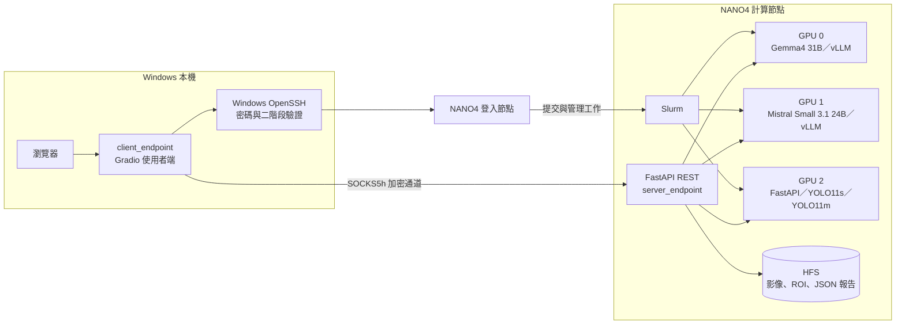

# 病理影像異常區域定位與結構化分析系統

PathoVision 結合 YOLO 異常區域定位、教師模型引導的技能／提示詞最佳化，以及學生多模態模型的結構化推論。系統先在病理影像中找出候選異常區域，再由使用者選擇真正要分析的 ROI，最後以固定 JSON Schema 產生逐區域、可追溯且可保存的形態學報告。

專案採用兩端點交付：Windows 使用者端放在 `client_endpoint/`；NCHC NANO4 的 API、模型、Slurm 與個案資料全部集中在 `server_endpoint/`。大型模型與醫療影像不需要離開伺服器。

> [!CAUTION]
> 本系統是研究用途的非診斷性病理影像形態輔助工具。YOLO 框選、模型文字與結構化報告都必須由合格專業人員複核，不得取代病理醫師判讀、臨床資訊整合、正式病理報告或醫療決策。


## 專案展示

- [系統操作展示影片](https://youtu.be/VvO4idV0dgA)
- 專案作者：呂建篁
- 實習單位：國家實驗研究院國家高速網路與計算中心
- 專案時間：2026/7/1 - 2026/8/31


## 研究動機

病理影像的異常區域定位與文字分析是影像解讀的重要基礎，但逐張檢視、人工框選與撰寫報告相當耗時，且自由文字不容易進行後續比較、統計與系統整合。本專案希望建立一條可重現的兩階段流程：

1. 以 YOLO 快速定位候選異常區域。
2. 只針對使用者選取的 ROI 執行多模態模型分析。
3. 以 Prompt、Skills 與 JSON Schema 約束輸出，減少格式漂移與禁止性診斷內容。
4. 將每個模型 × 每個 ROI 的結果獨立保存，供人工複核與回溯。


## 研究方法


### 一、RefPath 資料整理

研究以 RefPath 病理視覺定位資料為基礎。原始資料提供病理影像、自然語言區域描述及 bounding box；本專案再整理成 YOLO 訓練與評估所需記錄。簡報所列的專案處理後切分如下：

| 切分 | 記錄數 | 比例 |
|---|---:|---:|
| 訓練集 | 106,076 | 79.70% |
| 驗證集 | 13,556 | 10.19% |
| 測試集 | 13,464 | 10.12% |
| 合計 | 133,096 | 100% |

涵蓋內容包括肺癌、乳癌、腎癌與淋巴結轉移相關病理影像。上述數量是本專案經資料展開與整理後的訓練記錄數，不等同於 RefPath 官方公布的原始影像數或框選數。

### 二、YOLO 異常區域定位

在一致的資料與實驗設定下比較 9 個 YOLO 變體，並以 Precision、Recall、mAP 與 F1 score 評估：

| 模型 | 參數量（M） | Precision | Recall | mAP50 | mAP50–95 | F1 score |
|---|---:|---:|---:|---:|---:|---:|
| YOLOv8n | 0.31 | 68.6% | 77.6% | 77.8% | 63.8% | 0.728 |
| YOLOv8s | 11.2 | 66.7% | 78.0% | 73.7% | 61.2% | 0.727 |
| YOLOv8m | 25.9 | 74.0% | 79.6% | 81.8% | 68.8% | 0.767 |
| YOLO11n | 2.6 | 74.9% | 79.5% | 84.4% | 68.8% | 0.771 |
| **YOLO11s** | **9.5** | **77.2%** | 80.3% | 86.5% | 71.8% | 0.787 |
| **YOLO11m** | **20.1** | 76.8% | **81.7%** | **86.6%** | **72.6%** | **0.792** |
| YOLO26n | 2.4 | 74.9% | 78.4% | 83.9% | 68.2% | 0.766 |
| YOLO26s | 9.5 | 76.0% | 79.8% | 85.2% | 70.1% | 0.779 |
| YOLO26m | 20.4 | 72.1% | 77.4% | 80.5% | 64.8% | 0.746 |

YOLO11m 在 Recall、mAP50、mAP50–95 與 F1 score 表現最佳；YOLO11s 具有最高 Precision，且以較少參數維持接近 YOLO11m 的效能。因此部署端保留兩種選擇：YOLO11s 偏向速度與資源效率，YOLO11m 偏向整體定位效果。

### 三、教師引導的學生模型技能最佳化

研究階段以醫療專用的 MedGemma 1.5 作為教師模型，提供結構化輸出參考；再以通用多模態學生模型 Mistral Small 3.1 與 Gemma4 進行比較。最佳化時不更新學生模型權重，而是把 Prompt 與 Skills 視為可訓練的外部文字參數，透過 SkillOpt 反覆評分與更新。

教師模型只參與離線研究與最佳化，不是線上部署的必要服務。部署端使用經審查的 `best_prompt/`、`best_skills/` 與凍結的學生模型權重。

Soft Score 綜合評估以下面向：

- JSON Schema 合法性。
- 欄位值與教師參考的 Token F1 相似度。
- 狀態欄位正確性。
- 描述與可見影像證據的一致性。
- 摘要一致性。
- 禁止性輸出避免能力，例如不應直接輸出診斷或惡性判定。

#### SkillOpt 實驗結果

| 學生模型 | 最佳化對象 | Soft Score | Schema 合法率 | 禁止性輸出案例數 |
|---|---|---:|---:|---:|
| Mistral Small 3.1 | Skills | 0.0543 → 0.2685 | 10.22% → 83.33% | 12,088 → 2,245 |
| Mistral Small 3.1 | Prompt | 0.0190 → 0.1942 | 10.83% → 99.29% | 12,006 → 95 |
| Gemma4 | Skills | 0.4272 → 0.4300 | 95.68% → 95.94% | 581 → 546 |
| Gemma4 | Prompt | 0.1670 → 0.1691 | 95.35% → 97.34% | 626 → 358 |

Mistral 的輸出格式與禁止性內容改善幅度最明顯；Gemma4 的基線 Schema 合法率已高，因此增益較小。欄位內容相似度並非所有設定都同步上升，顯示「格式更正確」不等於「內容一定更接近教師」，仍需要病理專業人工驗證。

<details>
<summary>查看欄位內容相似度完整結果</summary>

| 學生模型 | 最佳化對象 | 最佳化前 | 最佳化後 | 變化 |
|---|---|---:|---:|---:|
| Mistral Small 3.1 | Skills | 20.38% | 18.43% | -1.95 個百分點 |
| Mistral Small 3.1 | Prompt | 19.50% | 27.09% | +7.59 個百分點 |
| Gemma4 | Skills | 33.76% | 33.98% | +0.22 個百分點 |
| Gemma4 | Prompt | 25.14% | 25.09% | -0.05 個百分點 |

</details>


## 系統功能

- 可選擇 YOLO11s 或 YOLO11m 進行異常區域定位。
- YOLO 無偵測結果時不啟動學生模型，避免無目標推論。
- 同一影像可勾選多個 ROI，且只分析被選取的區域。
- Gemma4 與 Mistral Small 3.1 可分別分析相同 ROI，報告互不覆蓋。
- 每份輸出套用模型專屬 Prompt、Skill Registry、Skills 與 JSON Schema。
- 報告頁可獨立切換模型與 ROI，結果以病理專業繁體中文呈現。
- 個案紀錄支援新增、載入、欄位修改、個案編號修改與整筆刪除。
- Server 保存原圖、定位圖、ROI、個案 metadata 與模型 × ROI 報告。
- Client 可提交及取消 Slurm Job，並輪詢 REST、Gemma4、Mistral 的載入進度。


## 端點與部署架構



### 部署邊界

| 端點 | 放置位置 | 內容 | 不應放置的內容 |
|---|---|---|---|
| `client_endpoint/` | Windows localhost | Gradio UI、REST Client、OpenSSH／SOCKS5h、Slurm 管理 | 模型權重、病理影像、Server 個案資料 |
| `server_endpoint/` | NCHC NANO4 的 `/work/<USER>/...` | FastAPI、YOLO、學生模型、vLLM 啟動、Slurm、個案資料 | SSH 密碼、OTP、提交至 Git 的 token |

Client 使用互動式 OpenSSH 完成密碼與二階段驗證，並透過同一工作階段提交 Slurm。實際 REST 流量經 localhost SOCKS5h 代理送到計算節點；vLLM 只綁定計算節點的 `127.0.0.1`，不直接暴露到外部網路。


## 專案結構

```text
2026_NCHC_Summer_Intern_Project/
├── client_endpoint/                 # 可獨立放到 Windows 的使用者端
│   ├── app.py
│   ├── api_client.py
│   ├── nchc_remote.py
│   ├── mcp_server.py
│   └── requirements.txt
├── server_endpoint/                 # 可獨立部署到 NCHC 的伺服器端
│   ├── pathovision_server.py        # FastAPI、YOLO、個案與報告 API
│   ├── student_vlm.py               # ROI、Prompt／Skill 與 vLLM 整合
│   ├── Localization_model/          # YOLO 說明與另行交付的權重
│   ├── Student_model/               # 學生模型控制檔與下載位置
│   ├── slurm/                       # 一張 Job 啟動三 GPU 服務
│   ├── scripts/                     # 模型安裝、驗證與 API key 工具
│   ├── tests/                       # Server、Schema、ROI 與持久化測試
│   ├── docs/                        # 維運與交接文件
│   ├── requirements.txt
│   └── TECHNOLOGY_STACK.md
├── .github/workflows/ci.yml
└── README.md
```


## 模型資產

GitHub repo 不包含大型模型權重、個案影像、報告或執行環境。

### YOLO 權重

YOLO11s 與 YOLO11m 另行打包為：

```text
2026_NCHC_Summer_Intern_Project_YOLO_weights.zip
└── Localization_model/
    ├── yolo11s_best.pt
    └── yolo11m_best.pt
```

壓縮包 SHA-256：

```text
7731db12b1c3fcdb39fe036772e0b69ab851ce8c80570626da85c5d42737a000
```

權重包不在 GitHub 中，請向專案維護者取得。個別權重雜湊與驗證方式請見 [`server_endpoint/Localization_model/README.md`](server_endpoint/Localization_model/README.md)。

### 學生多模態模型一鍵安裝

學生模型由 Hugging Face 自動下載；兩個模型約 160 GB，建議預留 180 GB。下載已整合到下方 Server 快速安裝，單模型與固定 revision 選項請見 [`server_endpoint/Student_model/README.md`](server_endpoint/Student_model/README.md)。


## 快速安裝

### 一、NCHC Server

```bash
git clone https://github.com/ChienHaungLu/2026_NCHC_Summer_Intern_Project.git
cd 2026_NCHC_Summer_Intern_Project/server_endpoint

# 解壓另行取得、放在 repo 根目錄的 YOLO 權重
unzip ../2026_NCHC_Summer_Intern_Project_YOLO_weights.zip -d .
# 安裝 Server 依賴
python3 -m venv .venv
.venv/bin/python -m pip install --upgrade pip
.venv/bin/python -m pip install -r requirements.txt

# 下載學生模型並驗證所有權重
python3 -m pip install --user --upgrade huggingface_hub
hf auth login
./scripts/install_student_vlm.sh
python3 scripts/verify_model_assets.py --include-yolo
```

提交 Slurm 前指定獨立 vLLM 環境的執行檔：

```bash
export PATHOVISION_VLLM_BIN=/absolute/path/to/vllm
```

### 二、Windows Client

在 Windows PowerShell 執行：

```powershell
cd client_endpoint
py -m venv .venv
.venv\Scripts\python -m pip install -r requirements.txt
.venv\Scripts\python app.py
```

不使用選配 MCP 時改以 `.venv\Scripts\python app.py --no-mcp` 啟動。預設介面為 `http://127.0.0.1:8200`。


## 啟動與操作

### 建議方式：由 Client 自動配置

1. 在 Windows 啟動 `client_endpoint/app.py`。
2. 輸入 NANO4 帳號、密碼並完成二階段驗證。
3. 選擇 `/work/<USER>/2026_NCHC_Summer_Intern_Project/server_endpoint`。
4. 選擇 Slurm partition、account 與資源後提交工作。
5. Job 進入 `RUNNING` 後即可進入分析頁；模型載入狀態會每兩秒更新。
6. 上傳原始影像並選擇 YOLO11s 或 YOLO11m。
7. 勾選要分析的 ROI，再選擇 Gemma4 或 Mistral Small 3.1。
8. 到結構化報告頁查看模型 × ROI 報告，或在個案紀錄頁管理資料。
9. 正常關閉 Client 或按下結束工作階段，歸還 Slurm 資源。

### 手動提交三 GPU Stack

```bash
cd /work/<USER>/2026_NCHC_Summer_Intern_Project/server_endpoint
export PATHOVISION_VLLM_BIN=/absolute/path/to/vllm
sbatch --account=<wallet-id> slurm/pathovision_vlm_stack.sbatch
```

預設資源分配：

| GPU | 服務 | 網路可見性 |
|---:|---|---|
| 0 | Gemma4 31B vLLM | 僅 `127.0.0.1` |
| 1 | Mistral Small 3.1 24B vLLM | 僅 `127.0.0.1` |
| 2 | FastAPI、YOLO11s、YOLO11m | 經 SOCKS5h 由 Client 存取 |


## 推論與保存流程

1. Client 上傳未標註的原始影像。
2. Server 用指定 YOLO 定位候選區域並建立個案。
3. 使用者勾選一個或多個 ROI；沒有偵測或沒有勾選時流程停止。
4. Server 從保存的乾淨原圖裁切 ROI，不使用畫過框的預覽圖。
5. 每個 ROI 獨立送入所選學生模型，同模型預設最多兩個請求並行。
6. 推論套用模型專屬 Prompt、Skill Registry、Skills 與 JSON Schema。
7. 每個模型 × ROI 的輸出獨立驗證與保存，單區域失敗不會覆蓋其他成功報告。

```text
.pathovision_server/cases/PV-.../
├── original.png
├── localized.png
├── roi_001.png
├── roi_002.png
├── student_vlm_gemma4_region_001.json
├── student_vlm_mistral-small-3.1_region_001.json
└── analysis.json
```


## 主要環境變數

| 變數 | 預設值或用途 |
|---|---|
| `PATHOVISION_PROJECT_DIR` | `server_endpoint/` 的絕對路徑 |
| `PATHOVISION_SERVER_PYTHON` | Server `.venv/bin/python` |
| `PATHOVISION_VLLM_BIN` | vLLM 執行檔絕對路徑，Slurm 必填 |
| `PATHOVISION_MODEL_PATH` | `Localization_model/yolo11m_best.pt` |
| `PATHOVISION_STUDENT_MODEL_ROOT` | `Student_model/` |
| `PATHOVISION_CASE_ROOT` | `.pathovision_server/cases` |
| `PATHOVISION_API_KEY` | REST 的 `X-API-Key`；自動模式會隨機產生 |
| `PATHOVISION_MAX_VLM_ROIS` | 單次最多 ROI，預設 4 |
| `PATHOVISION_VLM_MAX_CONCURRENT_PER_MODEL` | 每模型並行請求數，預設 2 |
| `PATHOVISION_VLLM_MAX_MODEL_LEN` | vLLM context 上限，預設 49,152 |
| `PATHOVISION_YOLO_HALF` | GPU YOLO 使用 FP16，預設 1 |

完整設定請參考 [`server_endpoint/.env.example`](server_endpoint/.env.example)。


## 測試

```bash
# Server、Schema、ROI 與資料持久化
cd server_endpoint
.venv/bin/python -m unittest discover -v tests

# Slurm 語法
bash -n slurm/pathovision_vlm_stack.sbatch slurm/pathovision_api.sbatch.example

# Client 邏輯
cd ../client_endpoint
python -m unittest discover -v . "test_*.py"
```

GitHub Actions 會在 push 與 pull request 時執行相同的依賴安裝、Slurm 語法檢查及兩端測試。


## 限制與後續方向

- Teacher 與 Student 仍可能產生幻覺或未被影像支持的描述。
- Schema 合法只能證明格式正確，不能證明內容具臨床正確性。
- 目前評估依賴教師參考與自動指標，仍需病理專家進行外部驗證。
- 後續可加入專家盲評、跨資料集泛化測試、校準分析與臨床流程可用性研究。
- 系統應持續維持「可見形態描述」與「正式醫療診斷」之間的明確界線。


## 文件導覽

- [`client_endpoint/README.md`](client_endpoint/README.md)：Windows 使用者端安裝與操作。
- [`server_endpoint/README.md`](server_endpoint/README.md)：NCHC Server 端獨立部署。
- [`server_endpoint/Student_model/README.md`](server_endpoint/Student_model/README.md)：學生模型下載、放置與驗證。
- [`server_endpoint/Localization_model/README.md`](server_endpoint/Localization_model/README.md)：YOLO 權重包與 SHA-256。
- [`server_endpoint/TECHNOLOGY_STACK.md`](server_endpoint/TECHNOLOGY_STACK.md)：技術棧。
- [`server_endpoint/docs/PROJECT_GUIDE.md`](server_endpoint/docs/PROJECT_GUIDE.md)：維運、交接與資料治理。


## References

1. Zhong, C., et al. [PathVG: A New Benchmark and Dataset for Pathology Visual Grounding](https://arxiv.org/abs/2502.20869). A pathology visual grounding benchmark and the source of the RefPath dataset.
2. Yang, Y., et al. [SkillOpt: Executive Strategy for Self-Evolving Agent Skills](https://arxiv.org/abs/2605.23904). A text-space optimization framework for improving external skills while keeping model weights frozen.
3. Sellergren, A., et al. [MedGemma 1.5 Technical Report](https://arxiv.org/abs/2604.05081). The technical report for the medical multimodal teacher model used in this project.
