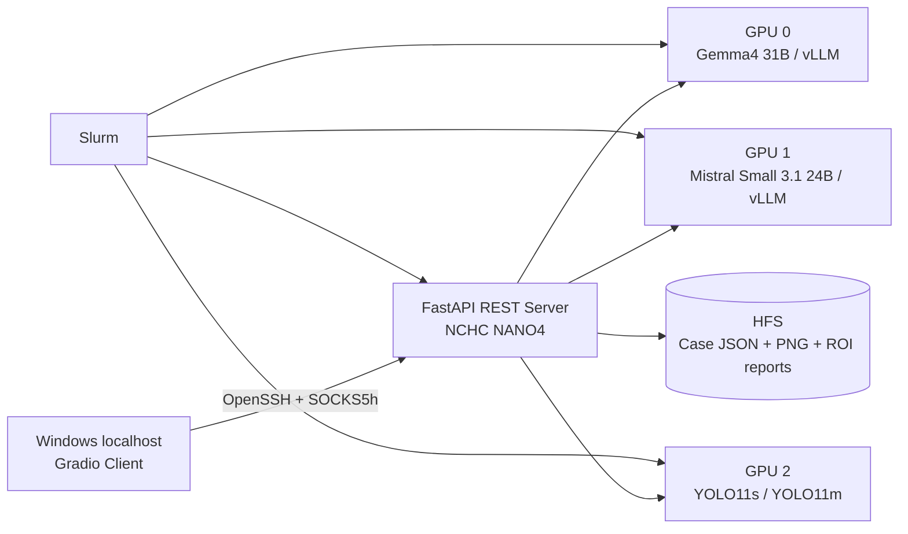

# 2026 NCHC Summer Intern Project — PathoVision

## GitHub 交付內容與首次安裝

此資料夾是可直接建立 GitHub repo 的純原始碼版本。為避免超過 GitHub 限制及誤散布模型，以下內容不在 repo 內：

- YOLO11s／YOLO11m 的 .pt 權重：另附 2026_NCHC_Summer_Intern_Project_YOLO_weights.zip。
- Gemma4／Mistral Student VLM 權重：由 Hugging Face 自動下載。
- .venv、案例影像、報告、Slurm runtime 與 log：在部署端產生。

首次部署至 NCHC Server：

~~~bash
git clone <GITHUB_REPO_URL> 2026_NCHC_Summer_Intern_Project
cd 2026_NCHC_Summer_Intern_Project

# 將另附的 YOLO 壓縮包解到 repo 根目錄
unzip ../2026_NCHC_Summer_Intern_Project_YOLO_weights.zip -d .

# 安裝 Server 依賴
python3 -m venv .venv
.venv/bin/python -m pip install --upgrade pip
.venv/bin/python -m pip install -r requirements.txt

# 下載及驗證兩個 Student VLM
./scripts/install_student_vlm.sh

# 同時驗證 Student VLM 與 YOLO 權重
python3 scripts/verify_model_assets.py --include-yolo
~~~

Student VLM 的登入、單模型下載、固定 revision、磁碟需求與手動安裝方式請見 [Student_model/README.md](Student_model/README.md)。YOLO 壓縮包內容與 SHA-256 請見 [Localization_model/README.md](Localization_model/README.md)。

病理醫療影像異常定位之結構化分析輔助系統。

PathoVision 採 Client–Server 架構：使用者在 Windows localhost 操作 Gradio Client，透過原生 OpenSSH 與 SOCKS5h Tunnel 連線至 NCHC NANO4。影像、模型權重、GPU 推論與個案資料皆保留在 Server；Client 負責操作與結果呈現。

> 本系統為非診斷性病理影像形態輔助工具，不得取代病理專業判讀、臨床資訊整合或正式醫療診斷。

## 主要功能

- 可選擇 `YOLO11s` 或 `YOLO11m` 進行異常區域定位。
- 未偵測到異常區域時，不啟動結構化分析模型。
- 同一影像可選擇多個異常區域，且只分析使用者勾選的 ROI。
- 每個 ROI 皆由 Gemma4 或 Mistral Small 3.1 獨立產生結構化報告；同模型最多兩個 ROI 平行推論。
- 結構化推論強制載入所選模型目錄中的 `best_prompt`、`best_skills`、欄位 Skill 對應與 JSON Schema。
- 報告以病理與醫學專業繁體中文呈現，保留必要中英對照。
- 報告頁提供彼此獨立的「分析推論模型」與「異常區域」下拉選單；同一個案可保存多個模型 × 多個 ROI 的報告。
- 「03 個案紀錄」支援新增、右鍵載入、欄位名稱／欄位值修改、個案編號修改及整筆刪除。
- Slurm 資源配置完成即進入分析頁，REST、Mistral、Gemma4 載入狀態每兩秒更新。

## 系統架構



完整技術說明請見 [TECHNOLOGY_STACK.md](TECHNOLOGY_STACK.md)。
專案目錄、部署、runtime 與訓練產物交接方式請見 [docs/PROJECT_GUIDE.md](docs/PROJECT_GUIDE.md)。

## 推論流程

1. Client 上傳未標註的原始影像。
2. Server 使用選定的 YOLO 模型定位候選異常區域並保存個案。
3. 使用者在原始影像預覽中勾選一個或多個 ROI。
4. 若未選取 ROI 或 YOLO 無偵測結果，流程在此停止，不呼叫分析推論模型。
5. Server 由保存的原始影像裁切所選 ROI；每個 ROI 分別送入當次所選的結構化模型。可再選另一模型分析相同 ROI，既有報告不會被覆蓋。
6. 每次分析推論均套用該模型的最佳 Prompt、Skill Registry、best skills 與 Output Schema。
7. 每份輸出獨立進行 JSON Schema 驗證並保存；部分區域失敗不會覆蓋其他成功報告。
8. Client 在「02 結構化視覺報告」分別選擇報告模型與異常區域；兩個選單互相獨立，異常區域選單只列出該模型已完成的報告。

預設單次最多選擇 4 個 ROI；同一模型最多同時處理 2 個請求，其餘自動接續。

## 專案結構

```text
2026_NCHC_Summer_Intern_Project/
├── Localization_model/          # YOLO 異常定位權重
│   ├── yolo11s_best.pt
│   └── yolo11m_best.pt
├── Student_model/               # 結構化分析推論模型、best prompt 與 best skills
│   ├── Gemma4/
│   └── Mistral-Small-3.1/
├── server/                      # FastAPI、YOLO、ROI 與分析推論模型整合
├── slurm/                       # NANO4 三 GPU 啟動腳本
├── client/                      # Windows localhost Gradio Client
├── tests/                       # 後端、Schema 與整合測試
├── scripts/                     # 輔助工具
├── docs/                        # 專案整理、部署與訓練產物交接
├── .pathovision_server/         # Server 個案資料（執行時產生）
├── .pathovision_runtime/        # Slurm 狀態與 Log（執行時產生）
├── requirements.txt
└── TECHNOLOGY_STACK.md
```

## 環境需求

### NCHC NANO4 Server

- Linux、Slurm 與可用的 NANO4 計算節點。
- 建議 3 張 NVIDIA H200 GPU：Gemma、Mistral、YOLO／FastAPI 各使用一張。
- 專案 `.venv` 目前使用 Python 3.9；vLLM 使用 `PATHOVISION_VLLM_BIN` 指定的獨立 Runtime。
- `Localization_model/` 與 `Student_model/` 必須保留在 Server，不需複製至 localhost。
- Gemma 與 Mistral 權重、Prompt、Skill 與 Schema 必須完整存在。

### Windows localhost Client

- Windows 10/11。
- Python 3.9 以上。
- Windows 原生 `ssh.exe`。
- 可連線至 NANO4 公開登入節點，並能完成密碼與 2FA 驗證。

## 安裝

### 1. Server Python 環境

```bash
cd /work/<USER>/2026_NCHC_Summer_Intern_Project
python -m venv .venv
.venv/bin/python -m pip install --upgrade pip
.venv/bin/python -m pip install -r requirements.txt
```

若已存在 `.venv`，不需重新建立。直接執行專案指令不會自動啟用虛擬環境；Slurm 腳本會直接呼叫 `.venv/bin/python`。互動式操作可使用：

```bash
source .venv/bin/activate
```

vLLM 可使用獨立環境，並以環境變數指定：

```bash
export PATHOVISION_VLLM_BIN=/absolute/path/to/vllm
```

### 2. Windows Client 環境

將 `client/` 放在使用者 localhost 後執行：

```powershell
cd client
py -m venv .venv
.venv\Scripts\python -m pip install --upgrade pip
.venv\Scripts\python -m pip install -r requirements.txt
.venv\Scripts\python app.py
```

不需要 MCP 時可執行：

```powershell
.venv\Scripts\python app.py --no-mcp
```

預設 UI：`http://127.0.0.1:8200`

## 啟動方式

### 建議：由 Windows Client 自動配置

1. 開啟 Client。
2. 確認畫面上的 NANO4 主機與 SSH Port（兩欄固定不可修改），輸入帳號、密碼與 2FA。
3. 選擇 `/work/<USER>/2026_NCHC_Summer_Intern_Project`。
4. 提交 Slurm Job。
5. Job 進入 `RUNNING` 後，Client 立即顯示分析頁。
6. 模型尚未完成時，可在分析頁查看 REST、Mistral、Gemma4 載入進度。

Client 正常關閉或按下「結束工作階段並歸還資源」時，會取消由該 Client 提交的 Slurm Job。

### 手動提交整合式 Stack

```bash
cd /work/<USER>/2026_NCHC_Summer_Intern_Project
sbatch --account=<wallet-id> slurm/pathovision_vlm_stack.sbatch
```

整合腳本會：

- 啟動 Gemma4 vLLM。
- 啟動 Mistral Small 3.1 vLLM。
- 啟動 FastAPI／YOLO Server。
- 建立 `.pathovision_runtime/<job-id>.env`，供 Client 建立 Tunnel。

## 模型與 Prompt／Skill 配置

### 異常定位模型

| Key | 權重路徑 | UI 定位 |
|---|---|---|
| `yolo11s` | `Localization_model/yolo11s_best.pt` | 推論快且較準確 |
| `yolo11m` | `Localization_model/yolo11m_best.pt` | 推論稍慢且最準確 |

可用 `PATHOVISION_MODEL_PATH` 覆寫預設 YOLO11m 權重；YOLO11s 預設從同一 `Localization_model/` 目錄載入。

### 結構化分析模型

| Key | 模型 | UI 定位 | 必要控制檔 |
|---|---|---|---|
| `mistral-small-3.1` | Mistral Small 3.1 24B | 推論較快，理解與推理次佳 | `best_prompt/`、`best_skills/` |
| `gemma4` | Gemma4 31B | 推論較慢，理解與推理最佳 | `best_prompt/`、`best_skills/` |

每個可用模型至少必須包含：

```text
best_prompt/Prompt.md
best_prompt/Global_Rules.md
best_prompt/Output_Schema.json
best_prompt/Output_Field_Skill_Mapping.yaml
best_prompt/Skill_Registry.yaml
best_skills/*.md
```

缺少權重、Prompt、Registry、Schema 或 Registry 指定 Skill 時，該模型不會標示為 `inference_ready`。

## 重要環境變數

| 變數 | 預設值／用途 |
|---|---|
| `PATHOVISION_MODEL_PATH` | `Localization_model/yolo11m_best.pt` |
| `PATHOVISION_STUDENT_MODEL_ROOT` | `Student_model/` |
| `PATHOVISION_CASE_ROOT` | `.pathovision_server/cases` |
| `PATHOVISION_API_KEY` | REST `X-API-Key`；自動模式會產生 |
| `PATHOVISION_VLLM_BIN` | vLLM 執行檔絕對路徑 |
| `PATHOVISION_MAX_VLM_ROIS` | 單次最多 ROI，預設 4 |
| `PATHOVISION_VLM_MAX_CONCURRENT_PER_MODEL` | 每模型同時推論數，預設 2 |
| `PATHOVISION_VLLM_MAX_NUM_SEQS` | vLLM 動態批次上限，預設 2 |
| `PATHOVISION_VLM_MAX_MODEL_LEN` | vLLM Context 上限，預設 49152 |
| `PATHOVISION_VLLM_SKIP_MM_PROFILING` | 預設 1，加速多模態冷啟動 |
| `PATHOVISION_YOLO_HALF` | GPU YOLO FP16，預設 1 |
| `PATHOVISION_PRELOAD_LOCALIZATION_MODELS` | 背景預載 YOLO，預設 1 |

## REST API 摘要

| Method | Endpoint | 功能 |
|---|---|---|
| `GET` | `/healthz` | REST 與 YOLO 基本狀態 |
| `GET` | `/api/v1/model` | YOLO／Student 模型清單與就緒狀態 |
| `GET` | `/api/v1/student-models` | 結構化模型資源與端點狀態 |
| `POST` | `/api/v1/analyses` | YOLO-only 定位並建立個案 |
| `POST` | `/api/v1/analyses/{case_id}/student-analysis` | 分析指定 ROI；每區域獨立報告 |
| `GET` | `/api/v1/analyses` | 取得 Server 個案清單 |
| `GET` | `/api/v1/analyses/{case_id}` | 載入完整個案 |
| `POST` | `/api/v1/cases` | 新增空白個案 |
| `PATCH` | `/api/v1/analyses/{case_id}` | 修改欄位與個案編號 |
| `PATCH` | `/api/v1/analyses/{case_id}/structured-analysis` | 相容／管理用途：修改指定模型與 ROI 的結構化報告；目前 UI 不提供報告編輯 |
| `DELETE` | `/api/v1/analyses/{case_id}` | 刪除個案及其 Server artifacts |

受保護 API 需提供：

```http
X-API-Key: <PATHOVISION_API_KEY>
```

## 個案儲存格式

```text
.pathovision_server/cases/PV-.../
├── original.png
├── localized.png
├── roi_001.png
├── roi_002.png
├── student_vlm_analysis.json    # 舊 Client 相容：第一份成功報告
├── student_vlm_gemma4_region_001.json
├── student_vlm_mistral-small-3.1_region_001.json
├── student_vlm_gemma4_region_002.json
└── analysis.json                # 個案 metadata、偵測與全部報告狀態
```

新格式以 `student_vlm_<model-key>_region_<detection-index>.json` 保存模型 × ROI 報告；Server 仍可讀取舊版未含 model key 的檔名。

## 測試

```bash
cd /work/<USER>/2026_NCHC_Summer_Intern_Project

# Server、Schema、ROI 與資料持久化測試
.venv/bin/python -m unittest discover -v tests

# Windows Client 與 Slurm 管理邏輯測試
cd client
python -m unittest discover -v . "test_*.py"

# Slurm 腳本語法
cd ..
bash -n slurm/pathovision_vlm_stack.sbatch
```

## 故障排除

- **定位模型不存在**：確認 `Localization_model/yolo11s_best.pt` 與 `Localization_model/yolo11m_best.pt`。
- **結構化模型未出現在清單**：檢查權重、`best_prompt`、`best_skills` 及 vLLM `/v1/models`。
- **Client 已進入分析頁但按鈕尚未啟用**：查看頁面內模型服務準備進度，模型就緒後會自動啟用。
- **無異常區域報告**：YOLO 無偵測或使用者未勾選 ROI 時，系統依設計不呼叫分析推論模型。
- **右鍵個案選單未出現**：重新整理 localhost Client，將游標移至資料列後按右鍵。
- **Slurm 啟動失敗**：查看 `.pathovision_runtime/slurm-<job-id>.err` 及模型 vLLM Log。

## 安全與資料邊界

- 密碼與 2FA 只寫入互動式 OpenSSH 終端，不放入命令列。
- REST API 使用隨機 `X-API-Key`。
- Runtime 狀態檔權限為 `0600`，runtime 目錄為 `0700`。
- 原始影像、ROI、模型與個案報告不需離開 NANO4。
- 所有模型輸出都會先通過 JSON Schema 驗證；目前報告頁為唯讀，避免在 UI 中意外改動模型原始輸出。
