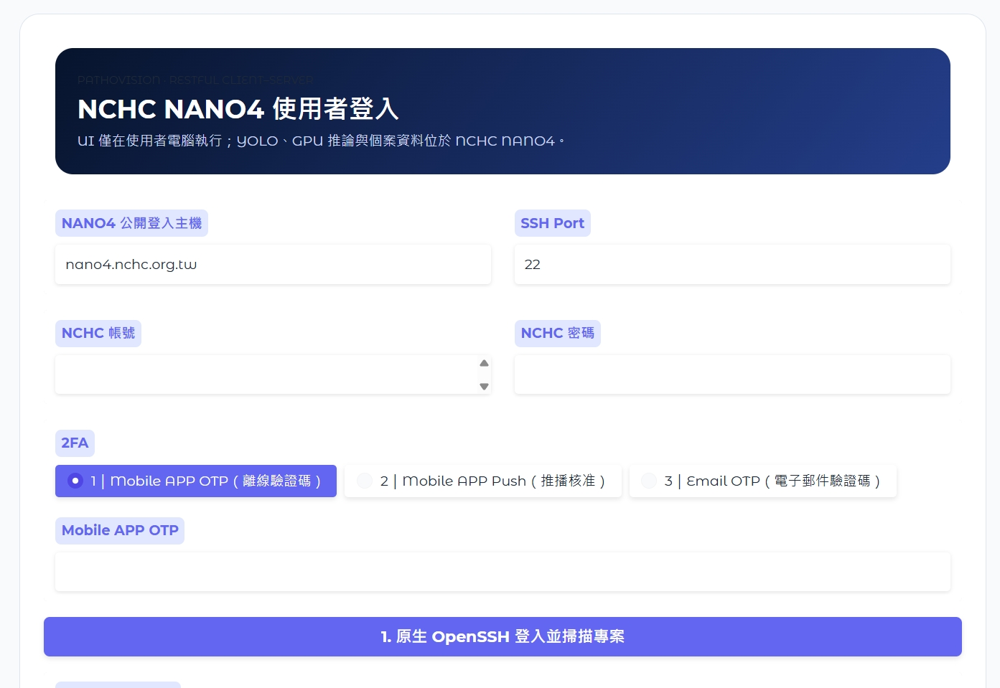
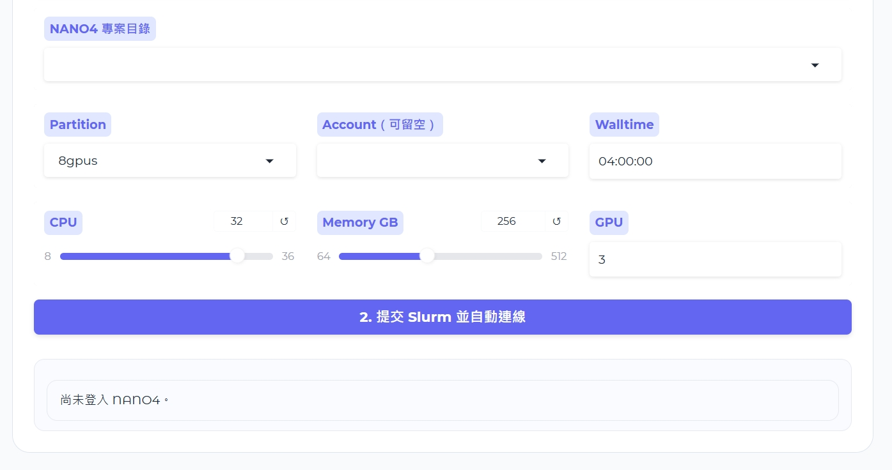

# System Visualization
說明: 本專案系統之視覺化介面, 採用先登入後租借模型推論所需的運算資源/節點後，才允續進入系統頁面存取系統的功能  

**系統功能如下:**
- 運算資源租借登入
- 視覺定位與分析
- 視覺化結構分析報告
- 個案紀錄檢視及存取

 

## 登入介面
<table><tr><td></td></tr></table>

<table><tr><td></td></tr></table>

  

## 醫學影像異常區域定位、分析及摘要

<table><tr><td></td></tr></table>

<table><tr><td></td></tr></table>

<table><tr><td></td></tr></table>

<table><tr><td></td></tr></table>

  

## 視覺化報告

<table><tr><td></td></tr></table>

<table><tr><td></td></tr></table>

<table><tr><td></td></tr></table>

<table><tr><td></td></tr></table>

<table><tr><td></td></tr></table>

<table><tr><td></td></tr></table>

<table><tr><td></td></tr></table>

  

## 個案紀錄存取

<table><tr><td></td></tr></table>

  

<table><tr><td></td></tr></table>

  

<table><tr><td></td></tr></table>
