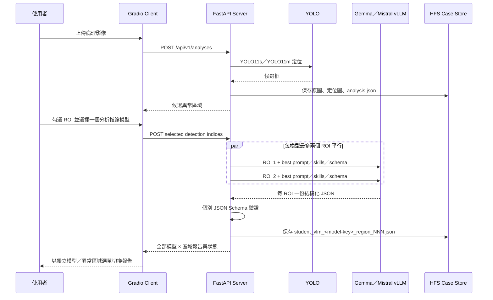

# PathoVision Technology Stack

本文件說明 PATHOVISION Analysis System 的實際技術組成、元件責任與資料流。根目錄 README 提供安裝與操作流程；目錄責任與產物交接請見 [docs/PROJECT_GUIDE.md](docs/PROJECT_GUIDE.md)。

<table>
  <tr><td bgcolor="#ffffff"></td></tr>
</table>

> 圖片為技術分類總覽；下表依目前程式碼補充 YOLO11s、vLLM、Pydantic、Pillow、JSON Schema 與多 ROI 平行推論等最新實作。

## 技術總覽

| 分類 | 項目 | 技術 | 系統用途 |
|---|---|---|---|
| 前端 | Web 操作介面 | Gradio `>=4.44,<6` | localhost 上傳影像、模型選擇、ROI 勾選、模型／異常區域獨立切換報告與個案管理 |
| 前端 | 視覺設計 | CSS、原生 JavaScript | 響應式版面、載入進度、ROI 報告閱讀模式與個案右鍵選單 |
| Client | 影像處理 | Pillow `>=10,<12` | EXIF 校正、RGB 正規化、選取框預覽與影像傳輸 |
| Client | REST／Proxy | Requests + SOCKS | 經 SOCKS5h Tunnel 呼叫 NANO4 REST API |
| Client | SSH 互動 | Windows OpenSSH、pywinpty | 密碼／2FA 互動、Slurm 提交、Tunnel 與 Session 回收 |
| 後端 | 程式語言 | Python 3.9 | 推論協調、API、資料持久化與測試 |
| 後端 | REST Framework | FastAPI、Uvicorn | JSON／multipart API、OpenAPI、認證與 artifact 回傳 |
| 後端 | 資料模型 | Pydantic 2 | Request／Response 驗證與 OpenAPI Schema |
| 後端 | 影像處理 | Pillow | 原始影像保存、YOLO ROI 裁切與 PNG artifact |
| AI／ML | 深度學習 Runtime | PyTorch、CUDA | GPU 張量與 YOLO 推論基礎 |
| AI／ML | 異常定位 | Ultralytics YOLO11s、YOLO11m | 病理影像候選異常區域定位 |
| AI／ML | 結構化分析推論服務 | vLLM | Gemma／Mistral OpenAI-compatible multimodal endpoint |
| AI／ML | 結構化模型 | Gemma4 31B、Mistral Small 3.1 24B | 每個使用者選取 ROI 的病理形態結構化分析 |
| Prompt／Skill | 最佳化控制 | Microsoft SkillOpt 產物、best prompt、best skills | 套用 Teacher–Student 最佳化後的 Prompt／Skill 控制與欄位 Skill 對應 |
| Prompt／Skill | 結構驗證 | JSON Schema、jsonschema、PyYAML | Guided decoding、輸出 Schema 驗證與 Skill Registry 解析 |
| HPC | 運算平台 | NCHC NANO4、NVIDIA H200、HFS | GPU 推論、模型與個案資料存放 |
| HPC | 資源調度 | Slurm | 3 GPU、CPU、記憶體、Walltime 與 Job 生命週期管理 |
| 網路 | 安全連線 | OpenSSH、SOCKS5h | localhost 與私有 Compute Node 服務之間的安全通道 |
| 架構 | 部署模式 | Client–Server | Client 僅呈現；Server 掌管模型、推論與個案資料 |
| 儲存 | Case artifacts | JSON、PNG、HFS | 個案 metadata、原圖、定位圖、ROI 與模型 × ROI 結構化報告 |
| 測試 | 自動驗證 | unittest、OpenAPI、Node.js parse、`bash -n` | 前後端回歸、API Schema、Client JS 與 Slurm 語法驗證 |

## 元件責任

| 元件 | 執行位置 | 主要責任 | 不負責事項 |
|---|---|---|---|
| Gradio Client | Windows localhost | UI、SSH／2FA、Slurm 工作階段、REST 呼叫、視覺報告 | 不載入模型、不直接保存 Server 個案 |
| FastAPI Server | NANO4 GPU Node | API Key 驗證、YOLO、ROI、分析推論協調、Schema 驗證、CRUD | 不公開至 Internet，不管理使用者密碼 |
| YOLO Runtime | NANO4 GPU 2 | YOLO11s／YOLO11m 定位與 FP16 推論 | 不產生診斷、不呼叫分析推論模型 |
| Gemma vLLM | NANO4 GPU 0 | Gemma4 31B 多模態結構化推論 | 不讀取未選取區域 |
| Mistral vLLM | NANO4 GPU 1 | Mistral Small 3.1 24B 多模態結構化推論 | 不讀取未選取區域 |
| HFS Case Store | NANO4 | 原圖、定位圖、ROI、JSON 報告與個案欄位 | 不同步至 localhost，除非使用者透過 UI 明確查看 |
| Slurm | NANO4 | GPU／CPU／Memory 配置、Job 排程與資源回收 | 不處理醫療影像內容 |

## 模型部署

| 階段 | Model key | 模型／權重 | 預設位置 | Serving |
|---|---|---|---|---|
| 異常定位 | `yolo11s` | YOLO11s best | `Localization_model/yolo11s_best.pt` | FastAPI Process／Ultralytics |
| 異常定位 | `yolo11m` | YOLO11m best | `Localization_model/yolo11m_best.pt` | FastAPI Process／Ultralytics |
| 結構化分析 | `mistral-small-3.1` | Mistral Small 3.1 24B Instruct | `Student_model/Mistral-Small-3.1/` | vLLM OpenAI-compatible API |
| 結構化分析 | `gemma4` | Gemma4 31B IT | `Student_model/Gemma4/` | vLLM OpenAI-compatible API |

每個結構化模型擁有自己的 `best_prompt/` 與 `best_skills/`。FastAPI 只有在權重、Prompt、Schema、Skill Registry、Registry 指定 Skills 與 vLLM endpoint 全部就緒時，才將模型標示為 `inference_ready=true`。

## 資料流



## 推論與載入最佳化

- Gemma、Mistral 與 YOLO 分配至不同 GPU，避免模型互相搶占顯存。
- Gemma 與 Mistral 服務平行啟動。
- `PATHOVISION_VLLM_SKIP_MM_PROFILING=1` 減少多模態啟動 Profiling。
- vLLM 使用 Prefix Caching、CUDA Graph／Compilation、Safetensors Prefetch 與 `performance-mode=interactivity`。
- `max-num-seqs=2` 配合同模型兩個 API in-flight requests，讓獨立 ROI 可動態批次處理。
- YOLO 在背景預載，GPU 模式預設使用 FP16。
- ROI 在送入分析推論模型前限制最大邊長與 Pixel 數，兼顧視覺 Token、延遲與顯存。
- Prompt／Skill Bundle 在 Server Process 中快取，避免每次重讀完整控制檔。

## 通訊與安全

```text
Browser / localhost
        │
        ▼
Gradio Client ── Windows OpenSSH / SOCKS5h ──► NANO4 Compute Node FastAPI
                                                        │
                                      127.0.0.1-only vLLM endpoints
```

- NANO4 內部 vLLM Endpoint 綁定 `127.0.0.1`。
- REST 請求使用 `X-API-Key`。
- SSH 密碼與 2FA 不放入命令列。
- Client 關閉時會取消自己提交的 Slurm Job。
- Runtime 檔案採 `0600`，目錄採 `0700`。

## 版本來源

Python 套件版本以以下檔案為準：

- Server（兩份保持同步）：[requirements.txt](requirements.txt)、[server/requirements.txt](server/requirements.txt)
- Windows Client：[client/requirements.txt](client/requirements.txt)
- vLLM：由 `PATHOVISION_VLLM_BIN` 指向的 NANO4 Runtime 決定。

## 醫療使用邊界

PathoVision 僅整理影像中直接可見的形態特徵。YOLO 類別、信心分數、分析推論模型描述及結構化報告均須由合格專業人員複核，不得單獨用於疾病診斷、治療決策或取代正式病理報告。
