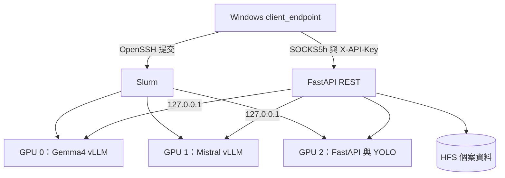

# PathoVision NCHC 伺服器端

`server_endpoint/` 是可獨立部署到 NCHC NANO4 的伺服器端專案根目錄，包含 FastAPI、YOLO、學生多模態模型控制檔、模型安裝工具、Slurm 啟動腳本、測試與維運文件。

Windows 使用者端位於 repo 根目錄的 [`client_endpoint/`](../client_endpoint/README.md)。Server 不需要將模型、影像或個案資料傳到 Windows；Client 透過 OpenSSH 與 SOCKS5h 存取計算節點 API。

> 本系統是研究用途的非診斷性工具，所有輸出都必須由合格專業人員複核。

## 目錄

```text
server_endpoint/
├── pathovision_server.py       # FastAPI、YOLO、個案與報告 API
├── student_vlm.py              # ROI、Prompt／Skill、Schema 與 vLLM 整合
├── Localization_model/         # YOLO 權重放置處
├── Student_model/              # Gemma4／Mistral 權重與控制檔
├── slurm/                      # NANO4 三 GPU 啟動腳本
├── scripts/                    # 模型安裝、資產驗證與 API key 工具
├── tests/                      # Server 回歸測試
├── docs/                       # 維運與交接文件
├── .env.example
├── requirements.txt
└── TECHNOLOGY_STACK.md
```

## 環境需求

- Linux 與 Slurm。
- Python 3.9 以上。
- 建議三張 NVIDIA H200 GPU。
- 可存取 NCHC HFS 的計算節點。
- FastAPI／YOLO 專用 Python venv。
- 可執行 vLLM 的獨立環境。
- 下載學生模型時可連線 Hugging Face，正式推論可離線。

## 安裝 Server 環境

```bash
cd /work/<USER>/2026_NCHC_Summer_Intern_Project/server_endpoint
python3 -m venv .venv
.venv/bin/python -m pip install --upgrade pip
.venv/bin/python -m pip install -r requirements.txt
```

vLLM 使用獨立環境，並提供執行檔絕對路徑：

```bash
export PATHOVISION_VLLM_BIN=/absolute/path/to/vllm
```

## 安裝模型

### YOLO

將另行取得的權重包放到 repo 根目錄，再於本目錄解壓：

```bash
unzip ../2026_NCHC_Summer_Intern_Project_YOLO_weights.zip -d .
sha256sum -c Localization_model/SHA256SUMS
```

完整說明請見 [`Localization_model/README.md`](Localization_model/README.md)。

### Gemma4 與 Mistral

```bash
python3 -m pip install --user --upgrade huggingface_hub
hf auth login
./scripts/install_student_vlm.sh
```

腳本會建立 `.hf-model-installer/`、下載到固定位置並驗證權重、Prompt、Schema 與 Skills。完整說明請見 [`Student_model/README.md`](Student_model/README.md)。

全部模型就緒後可執行：

```bash
python3 scripts/verify_model_assets.py --include-yolo
```

## 部署架構



整合式 Slurm 腳本會動態分配三個連接埠、平行啟動兩個 vLLM、啟動 REST／YOLO，並把該 Job 的 node、port、ready 狀態與 API key 寫到 `.pathovision_runtime/<job-id>.env`。Client 只讀取自己 Job 的狀態檔。

## 啟動

建議由 Windows Client 自動提交。手動提交方式如下：

```bash
cd /work/<USER>/2026_NCHC_Summer_Intern_Project/server_endpoint
export PATHOVISION_VLLM_BIN=/absolute/path/to/vllm
sbatch --account=<wallet-id> slurm/pathovision_vlm_stack.sbatch
```

只啟動單 GPU REST／YOLO 的參考腳本為 `slurm/pathovision_api.sbatch.example`；正式完整流程應使用三 GPU Stack。

## 資料與 Runtime

```text
.pathovision_runtime/                  # Job 狀態與 log，執行時產生
.pathovision_server/cases/<case-id>/   # 個案影像、ROI 與 JSON 報告
```

兩個目錄都已排除於 Git。`.pathovision_server/` 可能包含敏感醫療資料，不得直接複製到公開 repo 或未授權位置。

## 測試

```bash
cd /work/<USER>/2026_NCHC_Summer_Intern_Project/server_endpoint
.venv/bin/python -m unittest discover -v tests
bash -n slurm/pathovision_vlm_stack.sbatch slurm/pathovision_api.sbatch.example
```

## 維運文件

- [`TECHNOLOGY_STACK.md`](TECHNOLOGY_STACK.md)：元件、資料流、模型服務與安全邊界。
- [`docs/PROJECT_GUIDE.md`](docs/PROJECT_GUIDE.md)：部署交接、產物更新、測試與資料治理。
- [`Student_model/README.md`](Student_model/README.md)：學生模型自動安裝與目錄契約。
- [`Localization_model/README.md`](Localization_model/README.md)：YOLO 權重包與雜湊驗證。
